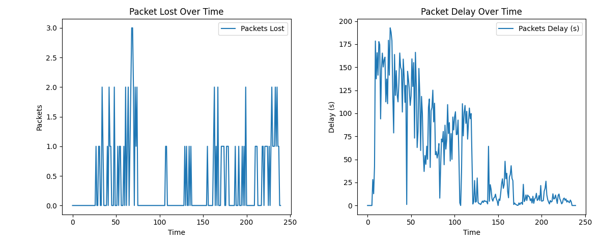

# **AI-Based Routing in a UAV Swarm Network**

## **Overview**  

This project explores the implementation and analysis of AI-driven routing protocols, specifically focusing on **Q-routing**, for Unmanned Aerial Vehicle (UAV) swarm networks. The goal is to address the challenges of dynamic network topologies, node mobility, and fluctuating traffic loads within UAV networks.  

Developed using **Python** and the **SimPy** library, this simulation models a 10-node UAV swarm network, assessing key performance metrics such as throughput, latency, scalability, and reliability. The study highlights the potential of Q-routing as a robust, adaptable, and efficient solution for dynamic UAV networks.  

---

## **Features**  

- **Q-Routing Implementation:** A reinforcement learning-based routing protocol that dynamically updates routing tables using real-time feedback.  
- **Simulated UAV Swarm:** A 10-node network following a coordinated area search mission.  
- **Real-Time Metrics:** Monitors packet loss, end-to-end delay, and network throughput.  
- **Scalability Analysis:** Evaluates resource consumption and routing efficiency as the network scales.  
- **Visualization:** Real-time swarm visualization using Python's `tkinter` library.  

---

## **Simulation Details**  

- **Framework:** Python with SimPy for discrete-event simulation  
- **Topology:**  
  - 10 UAV nodes operating within a 400m x 800m area  
  - Constant drone speed: 20 m/s  
  - 3 stationary routers connected to a ground station  
  - Communication range: 150 meters  
- **Mission:** Each UAV covers a predefined section of the area, following generated waypoints  

---

## **Performance Metrics**  

- **Packet Loss:** Measures dropped packets due to congestion or connection loss  
- **End-to-End Delay:** Time taken for packets to travel from source UAVs to the ground station  
- **Resource Usage:** Evaluates CPU consumption and storage demands during simulations  

---

## **Key Findings**  

- **Adaptability:** Q-routing adapts efficiently to changing network conditions and traffic congestion  
- **Performance Gains:** Improved throughput and reduced latency under high-traffic scenarios  
- **Scalability Issues:** Larger swarm sizes increase computational and memory overhead  

---

## **Future Enhancements**  

1. **Predictive Routing:** Integrating trajectory prediction to minimize route flapping  
2. **Energy Efficiency:** Optimizing for resource-constrained UAVs through lightweight algorithms  
3. **Hybrid Approaches:** Combining Q-routing with other AI methods (e.g., deep reinforcement learning)  
4. **Real-World Testing:** Extending simulations to physical UAV testbeds for practical validation  

---

## **High-Level Class Design**  
  

The code follows an **observer pattern**, where the `RadioMedium` class is responsible for managing packet transmission. It invokes the `sendPacket()` function to deliver packets to the host associated with the packet’s IP address.  

---

## **Results**  
  

The results of the routing study demonstrate a clear reduction in latency over time, highlighting the effectiveness of the adaptive Q-routing algorithm. Furthermore, packet loss remains minimal, with no more than three packets lost per second, even under high-traffic conditions.

---

## **Installation and Usage**  

1. **Clone the repository:**  
   ```bash
   git clone https://github.com/AbdullahTariqCS/QRouting-implementation
   cd QRouting-implementation
   ```  

2. **Install dependencies:**  
   ```bash
   pip install -r requirements.txt
   ```  

3. **Run the simulation:**  
   ```bash
   cd routing_study
   python network.py
   ```  
